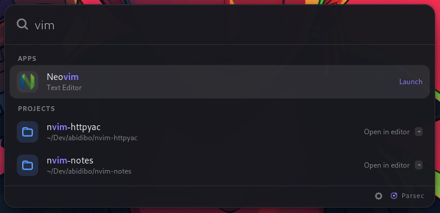

# Parsec

A personal launcher for GNOME. Press a key, type, press Enter.



Apps, your git projects, a shell runner, GitHub repositories and pull requests,
clipboard history with pinned snippets, and KeePass entries, all in one dark
panel that follows you between machines: everything that depends on the host
(editor, terminal, project folders, database path) is detected on first run,
written to a config file, and editable in a settings window.

Rust, GTK 4, libadwaita. Wayland first.

## Contents

- [Requirements](#requirements)
- [Install](#install)
- [First run](#first-run)
- [Using it](#using-it)
- [Settings and configuration](#settings-and-configuration)
- [GNOME Shell extension](#gnome-shell-extension)
- [Plugins](#plugins)
- [Styling](#styling)
- [Command line](#command-line)
- [Development](#development)
- [Troubleshooting](#troubleshooting)
- [Security notes](#security-notes)
- [License](#license)

## Requirements

Runtime:

| What | Why | Needed |
|---|---|---|
| GNOME 46 or newer, Wayland session | the launcher and its hotkey | yes |
| GTK 4.14+, libadwaita 1.5+ | the UI, already on any GNOME 46 system | yes |
| `wl-clipboard` | copying results and clipboard history | yes |
| `xclip` | clipboard history on GNOME 46 and 47 (see [below](#clipboard-on-gnome-46-and-47)) | recommended |
| `plocate` | files anywhere on disk; Tracker alone covers Documents, Downloads, Desktop and media | recommended |
| `docker`, `systemctl` | the `dk` and `svc` verbs | optional |
| `gh` (GitHub CLI), logged in | the `gh` and `pr` verbs | optional |
| the Parsec Shell extension | window switching, paste into the previous window, event-driven clipboard on any GNOME (see [below](#gnome-shell-extension)) | optional |

Build:

| Distribution | Packages |
|---|---|
| Ubuntu / Debian | `build-essential pkg-config libgtk-4-dev libadwaita-1-dev` |
| Fedora | `gcc pkg-config gtk4-devel libadwaita-devel` |
| Arch | `base-devel pkgconf gtk4 libadwaita` |

plus a Rust toolchain, 1.82 or newer, from <https://rustup.rs>.

Ubuntu 24.04 example, everything in one go:

```sh
sudo apt install build-essential pkg-config libgtk-4-dev libadwaita-1-dev wl-clipboard xclip plocate gh
curl --proto '=https' --tlsv1.2 -sSf https://sh.rustup.rs | sh
```

## Install

```sh
git clone https://github.com/abidibo/parsec.git
cd parsec
scripts/install.sh
```

The script:

1. builds a release binary
2. installs it to `~/.local/bin/parsec` and the icon to your icon theme
3. adds an autostart entry so the daemon starts at login
4. binds **Ctrl+Space** to toggle the launcher, as a GNOME custom shortcut
5. starts the daemon

Pick another key with `PARSEC_HOTKEY='<Super>space' scripts/install.sh`, or
change it later in GNOME Settings › Keyboard › Custom Shortcuts. Add
`PARSEC_EXTENSION=1` to also install the [Shell extension](#gnome-shell-extension).

`~/.local/bin` must be on your `PATH` for `parsec` to work from a shell; the
hotkey uses the full path and works regardless.

To uninstall: delete `~/.local/bin/parsec`, the two desktop files named
`org.abidibo.Parsec.desktop` under `~/.local/share/applications` and
`~/.config/autostart`, the custom shortcut, the extension with `parsec extension remove`, and
optionally `~/.config/parsec` and `~/.local/share/parsec`.

## First run

Press Ctrl+Space. The panel opens empty. Type a few letters of an application
name and press Enter.

On its first start Parsec looks around and writes
`~/.config/parsec/config.toml`:

- editor: `$VISUAL`, then `$EDITOR`, then an installed GUI editor (VS Code,
  Zed, GNOME Text Editor...), then a terminal one (nvim, vim, helix...).
  Terminal editors are launched inside your terminal, in the project folder.
- terminal: `$TERMINAL`, then kitty, wezterm, alacritty, foot, ptyxis,
  gnome-terminal, konsole, xfce4-terminal, xterm, each with the right
  working-directory flag.
- project folders: whichever of `~/Dev ~/dev ~/Projects ~/projects ~/Code
  ~/code ~/src ~/work ~/repos ~/git` exist.
- KeePass database: the first `.kdbx` found in your home or one level down.

Check the result with `parsec config`, or open the settings (see below) and
adjust. Nothing is hard-wired: a different machine gets a different file.

## Using it

Type to search. Results come from several providers at once; a leading verb
narrows the search to one of them.

| Type | Result |
|---|---|
| `fire` | applications, fuzzy matched, ranked by how often and how recently you pick them |
| `myproj` | git repositories under your project folders |
| `$ ls -la` | a shell command: runs in a terminal that stays open |
| `gh name` | your GitHub repositories |
| `pr` | your open pull requests |
| `cb text` | clipboard history |
| `kp name` | KeePass entries, after unlocking |
| `g query`, `w query` | custom shortcuts: Google and Wikipedia by default, add your own |
| `= 2*(3+4)` | the calculator plugin, once installed |
| `f name` | files by name, through GNOME's Tracker index and plocate |
| `ssh host` | hosts from `~/.ssh/config`; Enter connects in your terminal |
| `dk name` | Docker containers: shell, logs, start, stop, restart |
| `svc name` | systemd services, user and system: status, logs, restart |
| `win title` | open windows, with the Shell extension; also mixed into plain queries |
| `parsec` | Parsec's own entries: settings, quit |

Keys:

| Key | Action |
|---|---|
| ↑ ↓ | move the selection |
| Tab / Shift+Tab | cycle the selected row's actions; rows with several show a ⇥ mark |
| Enter | run the action shown on the right |
| Esc | close, cancel a password prompt, or step out of a list |
| ⌫ on an empty box | leave a keyword mode or step out of a list |
| Ctrl+, | settings |

Opening the launcher with nothing typed shows the things you have picked
before. Word verbs need a space (`gh foo`; `ghost` searches apps). Symbol
verbs don't (`$ls`).

### Projects

Actions: open in editor, open a terminal there, open the folder, copy the
path. Folders are rescanned every two minutes and whenever the setting changes.

Further down the Tab cycle, three actions open a list instead of leaving:

- *Branches*: local then remote, newest commit first, the current one
  marked. Enter switches to it in your terminal, so a failed switch stays
  on screen. Tab copies the name.
- *Commits*: the last fifty. Enter shows the diff in your terminal, Tab
  copies the hash.
- *Files*: the repository folder. Folders open further, files open in
  their application or your editor; both copy the path.

While a list is open its name sits in the chip, the search box filters it,
and Backspace or Esc step back out. Lists are loaded when opened, never
before, so nothing is computed for projects you never expand. Any provider
or plugin can offer such lists, see [Plugins](#plugins).

### Clipboard history and snippets

Enter copies an entry back to the clipboard; paste it with Ctrl+V in the app
you're in. With the [Shell extension](#gnome-shell-extension) Enter pastes
it straight into the window you came from (Ctrl+Shift+V in terminals) and
*Copy* moves to Tab. Tab also offers *Pin as snippet* and *Delete*. Pinned entries never
expire and show a star. History lives in `~/.local/share/parsec/clipboard.json`
with mode 0600.

#### Clipboard on GNOME 46 and 47

GNOME before 48 lacks the Wayland data-control protocol, so a background
process cannot be told about clipboard changes. Parsec then reads the
clipboard once a second through `xclip` and XWayland, which the compositor
keeps in sync with the Wayland clipboard. Install `xclip` or history stays off,
with a line in the log saying so. On GNOME 48+, sway or Hyprland it is
event-driven and needs nothing extra. The [Shell extension](#gnome-shell-extension)
makes it event-driven on any GNOME and replaces `xclip`.

### Files

`f name` searches file names. Two sources are merged: GNOME's Tracker index,
which follows Documents, Downloads, Desktop and media within seconds, and
plocate, which covers the whole disk but refreshes nightly (`sudo updatedb`
forces it). Every word you type must appear; the result is ranked fuzzily on
the file name with a boost for recently modified files. Actions: open, show
in folder, open a terminal there, open in editor, copy path. Settings ›
Providers limits the search to folders, excludes folder names, and toggles
hidden files and each source. Files are also suggested when a plain query
matches nothing else.

### Windows

With the [Shell extension](#gnome-shell-extension) running, open windows are
results too. A plain query matches window titles and application names
alongside everything else, so `fire` offers the Firefox window you already
have next to a fresh launch. `win` on its own lists every window, most
recent first; `win mail` filters. Enter switches to the window, changing
workspace if needed; Tab offers *Close window*.

### Infrastructure

- `ssh host`: aliases from `~/.ssh/config` with their user and host name.
  Enter opens your terminal running `ssh host`; an unknown name connects
  to it anyway.
- `dk name`: Docker containers, running ones first. Shell opens a terminal
  inside the container, Logs follows them, then restart, stop or start.
- `svc name`: systemd services, user and system. Status and Logs open in
  the terminal; restart, stop and start run directly for user units and
  through `sudo` in a terminal for system units.

### Custom shortcuts

A keyword that opens a URL or runs a script with what you typed, like
ulauncher's shortcuts. Settings › Shortcuts has the editor: name, keyword,
icon, the URL or script, and two switches:

- *Default search*: suggest it when a query matches nothing else, so a typo
  or an unknown word offers "Search Google for …".
- *Run without arguments*: Enter on the bare keyword runs it with an empty
  query. Off, the bare keyword asks what to search.

In a URL, `{query}` or `%s` is replaced by the text, percent-encoded. Anything
that isn't a URL runs as a shell script with the text as `$1` and
`$PARSEC_QUERY`, and a literal `{query}` replaced by the quoted text:

```sh
# "tr <text>": translate to Italian in a notification
notify-send "$(trans -b :it "$1")"
```

Shortcuts live in `[[shortcuts]]` tables in the config file.

### KeePass

`kp` shows *Unlock*. Enter turns the search box into a masked password field,
Enter again unlocks. Entries then match on title, username and URL; Enter
copies the password, Tab gives copy username and open URL. With the
[Shell extension](#gnome-shell-extension) Enter pastes the password into
the field you came from instead, and Tab adds *Paste username*; the
password is still kept out of the history and cleared after the timeout. *Lock database*
sits at the end of the list and auto-lock forgets the entries after ten
minutes. Recycle bin entries are hidden. The database is read with the pure
Rust `keepass` crate (KDBX 3 and 4, password and optional key file) and never
written.

## Settings and configuration

Open the settings with the gear in the launcher's footer, Ctrl+, while the
launcher is open, typing `parsec`, or `parsec settings` in a shell.

The settings window edits `~/.config/parsec/config.toml`. Changes save
immediately and the running daemon reloads them; the file is also fine to edit
by hand. Every key has a comment in the file. With defaults filled in for this
machine it looks like:

```toml
[projects]
roots = ["~/Dev"]
max_depth = 3

[editor]
command = ["nvim", "{path}"]
in_terminal = true

[terminal]
command = ["wezterm", "start", "--cwd", "{cwd}", "--", "{exec}"]

[github]
owners = []            # empty = the account gh is logged into
cache_secs = 300

[clipboard]
enabled = true
max_items = 200
max_bytes = 102400
poll_secs = 1          # GNOME 46/47 only

[keepass]
database = "~/Passwords.kdbx"
key_file = ""
lock_after_secs = 600
clipboard_clear_secs = 15
skip_groups = ["Recycle Bin", "Backup"]

[verbs]
shell = "$"
github = "gh"
prs = "pr"
clipboard = "cb"
keepass = "kp"
files = "f"
ssh = "ssh"
docker = "dk"
services = "svc"
windows = "win"

[files]
roots = ["~"]
exclude = ["node_modules", "target", "__pycache__", ".git", "snap", "venv", ".venv"]
hidden = false
tracker = true
plocate = true

[appearance]
theme = "dark"         # dark | light | system
accent = "system"      # system | "#rrggbb"

[shell]
extension = true       # use the Shell extension when it is running

[[shortcuts]]
name = "Google"
keyword = "g"
command = "https://www.google.com/search?q={query}"
icon = ""
default_search = true
run_without_args = false
```

Command templates are argv arrays. Placeholders: `{path}` the project folder,
`{cwd}` the terminal's working directory, `{exec}` the command the terminal
should run, which disappears together with its separator (`--`, `-e`, `-x`)
when there is nothing to run. Some terminals:

```toml
["gnome-terminal", "--working-directory={cwd}", "--", "{exec}"]
["kitty", "--directory={cwd}", "{exec}"]
["alacritty", "--working-directory", "{cwd}", "-e", "{exec}"]
["foot", "--working-directory={cwd}", "{exec}"]
```

## GNOME Shell extension

Parsec is a normal GTK application, and on Wayland that means it cannot see
other windows, type into them, or watch the clipboard on GNOME before 48.
A small optional extension, `data/extension/parsec@abidibo.org`, runs
inside GNOME Shell and lends Parsec those three abilities over D-Bus. It has
no interface of its own, and Parsec works unchanged without it: no window
results, Enter copies instead of pasting, and the clipboard is polled on
GNOME 46 and 47.

Install it from Settings › Launcher › *GNOME Shell extension*, with
`PARSEC_EXTENSION=1 scripts/install.sh`, or from a shell:

```sh
parsec extension install     # copies the files and enables the extension
parsec extension status
parsec extension remove
```

The extension is bundled inside the binary, so `install` always writes the
version matching your Parsec; the settings row offers *Update* when the one
on disk is older. **A logout is needed after installing or updating**: on
Wayland, GNOME Shell only loads extensions at login. The settings row and
`parsec extension status` say when that is the case. Until then, and on sway
or Hyprland, nothing changes.

What it gives you:

- **Windows** as results, see [above](#windows).
- **Paste**: clipboard entries, snippets and KeePass passwords land in the
  window you came from. Parsec hides, the extension waits for focus to return, then types
  Ctrl+V, or Ctrl+Shift+V when that window is a terminal.
- **Clipboard tracking without polling** on every GNOME version, and
  reliable "was it still there" checks before a copied password is cleared.

The `[shell] extension` switch in the config, also in settings, keeps the
extension installed but makes Parsec ignore it. The extension lists GNOME
45 to 49 in its `metadata.json`; a newer Shell refuses to load it until that
list is extended.

## Plugins

A plugin is a small program in any language that Parsec starts once and
talks to over stdin/stdout, one JSON object per line. Plugins live in
`~/.local/share/parsec/plugins/<id>/`.

### Installing

Settings › Plugins installs from a `.zip`, a folder, or a git URL, and lists
what is installed with an on/off switch and a remove button. From a shell:

```sh
parsec plugin install ~/Downloads/some-plugin.zip
parsec plugin install https://github.com/someone/parsec-something
parsec plugin install examples/plugins/calc      # the bundled calculator
parsec plugin list
parsec plugin remove calc
```

A running daemon notices new, removed or disabled plugins by itself.

### Writing one

Two files are enough. `plugin.toml`:

```toml
name = "Calculator"
id = "calc"                 # letters, digits, - and _; the folder name by default
version = "0.1.0"
description = "Evaluate arithmetic"
keywords = ["="]            # trigger words; empty = sees every query
exec = "main.py"            # relative to the plugin folder, made executable on install
icon = "accessories-calculator-symbolic"   # theme name or image file in the folder

[config]                    # optional, handed to the plugin at start
precision = 10
```

and the executable, which reads lines from stdin and answers each one with
exactly one line on stdout:

| Parsec sends | Plugin replies |
|---|---|
| `{"type":"init","version":"0.1.0","config":{...}}` | `{"type":"ready"}` |
| `{"type":"query","id":7,"text":"2+2","keyword":"="}` | `{"type":"results","id":7,"items":[...]}` |
| `{"type":"activate","item":"...","data":...,"text":"..."}` | `{"type":"ok"}` |
| `{"type":"browse","item":"...","data":...,"text":"..."}` | `{"type":"results","items":[...]}` |

`text` is what the user typed after the keyword. An item is:

```json
{"title": "14", "subtitle": "2*(3+4) =", "icon": "optional", "id": "optional",
 "score": 500,
 "actions": [{"label": "Copy", "copy": "14"}]}
```

Actions, one key each: `open` a URL, `copy` text, `copy_secret` text (kept
out of the clipboard history and cleared after 15 s), `run` an argv array,
`browse` with any JSON (opens a list, see below),
`paste` text (typed into the previous window with the Shell extension,
copied without it), `paste_secret` text (the same with the `copy_secret`
protections), or `callback` with any JSON, which comes back to the
plugin in an `activate` message when the user picks it. The first action runs on Enter, the others
are reachable with Tab. Items with no actions are informational.

A `browse` action asks the plugin for a list to drill into. Parsec sends
`{"type":"browse","item":"...","data":...,"text":"..."}` and expects a
`results` message like the answer to a query. Its items are ordinary items,
so they can `browse` again; the action's label names the list in the chip.
The user filters it in place and steps back with Backspace or Esc.

Rules of the road: answer within three seconds or the query is dropped and
the plugin restarted; three failures in a row disable it until Parsec restarts;
write nothing else to stdout (stderr is fine, it goes to Parsec's log); flush
after every line. `examples/plugins/calc/main.py` is a complete, commented
example in about sixty lines of Python.

## Styling

Settings › Launcher › Appearance picks the theme, dark, light, or following
GNOME's dark-style preference, and the accent: GNOME's own accent colour on
GNOME 47 and later, Parsec's violet otherwise, or any hex colour. Everything
else is CSS, and `~/.config/parsec/style.css` overrides it live:
save the file and the running launcher repaints. Settings › Launcher › *Edit
stylesheet* creates the file with a reference of every variable and selector.
For example:

```css
@define-color parsec_accent #ff7a59;
@define-color parsec_bg rgba(10, 10, 14, 0.85);
.parsec-entry { font-size: 24px; }
```

## Command line

```
parsec               start the daemon, or toggle the window if it already runs
parsec --background  start the daemon without showing the window (autostart uses this)
parsec toggle        same as plain parsec; reads better in a keybinding
parsec settings      open the settings window
parsec plugin ...    list | install <zip|dir|git-url> | remove <id>
parsec extension ... status | install | remove   (the GNOME Shell extension)
parsec config        print the effective configuration and the file path
parsec query <text>  run one search without a window and print the results
```

The first `parsec` process becomes the resident daemon. Every later invocation
is forwarded to it through GApplication's single-instance D-Bus mechanism, so
`parsec toggle` is what the hotkey runs. `parsec query` is the quickest way to
see what a provider returns. Logs go to stderr; `RUST_LOG=parsec=debug` for
more.

## Development

```sh
cargo build                 # debug build
cargo test                  # unit tests, including a KeePass fixture
scripts/dev.sh              # rebuild, restart the daemon from target/debug, show it
scripts/dev.sh --no-show    # rebuild and restart only
```

`scripts/dev.sh` logs to `dev.log` in the repository. To try things without
installing, point a GNOME custom shortcut at `target/debug/parsec toggle`.

Layout:

```
crates/parsec/src
├── main.rs          subcommands, logging
├── app.rs           GApplication wiring, daemon lifetime, app actions, config watcher
├── brand.rs         name, logo, version
├── autostart.rs     XDG autostart entry
├── plugins/         plugin packages: manifest, install, remove
├── config.rs        config file, templates, detection defaults
├── detect.rs        editor, terminal, project folder, database detection
├── gnome_shell.rs   the Shell extension: D-Bus bridge, install, status
├── core/            Item and Action model, Provider trait, Matcher, Frecency, Engine, secrets
├── providers/       apps, projects, shell, github, clipboard, keepass, shortcuts,
│                    files, infra (ssh, docker, services), windows, plugin host, system
└── ui/              launcher window, preferences window
```

A provider implements one trait: an id, an optional verb, and an async
`query` returning items with actions. Actions are launch an app, run a command,
copy text, copy a secret, paste text, open a URL, run a callback, prompt
the user for input, or browse into a list of further items. The extension lives in `data/extension` and is embedded
in the binary at build time. See `DESIGN.md` for the decisions and the roadmap.

## Troubleshooting

**The window appears and vanishes.** Something took keyboard focus away.
Run `RUST_LOG=parsec=debug parsec --background` from a terminal and watch for
`focus change` lines; a steady once-a-second flip means some other program is
polling the clipboard with `wl-paste`, which steals focus on GNOME.

**Ctrl+Space does nothing.** Check the shortcut exists in GNOME Settings ›
Keyboard › Custom Shortcuts and that its command is the full path to `parsec`.

**No clipboard history.** Install `xclip` on GNOME 46/47, or `wl-clipboard`
everywhere. The log says which backend is in use.

**`gh` results are empty.** Run `gh auth status`. The first query takes a
couple of seconds; results are cached for five minutes.

**Build fails on `libadwaita-sys`.** The development headers are missing:
install `libadwaita-1-dev` (Debian/Ubuntu) or `libadwaita-devel` (Fedora).

## Security notes

- KeePass entries are decrypted in memory only, forgotten on lock or timeout,
  never logged, never written. The frecency file stores hashed ids for them.
- A copied password is excluded from Parsec's clipboard history and cleared
  from the clipboard after `clipboard_clear_secs`.
- Other clipboard managers, including GNOME Shell extensions, still see
  whatever is copied. Parsec cannot prevent that.
- The clipboard history file and the config file are plain text in your home
  directory; the history file is created with mode 0600.

## License

MIT, see [LICENSE](LICENSE). Copyright (c) 2026 abidibo <abidibo@gmail.com>.
